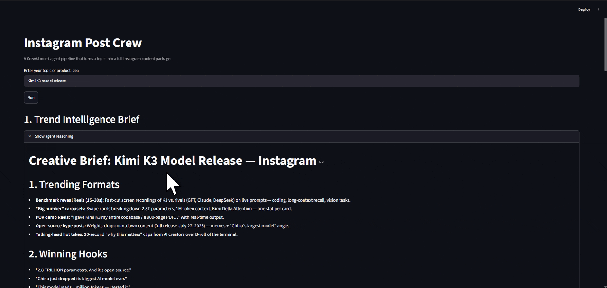

# Instagram Post Crew

A CrewAI multi-agent pipeline that takes a topic or product idea and produces a strategically reasoned Instagram content package. Four specialized agents work sequentially: a Trend Intelligence agent analyzes why specific formats and hooks are performing for the niche, a Copywriter agent generates three caption variants and reasons about which fits best, a Visual Strategist agent produces a trend-grounded image generation prompt, and a Posting Strategist agent recommends a publish time tied to niche audience behavior. Agent reasoning is fully visible in the UI.



## Features

- Trend analysis that goes beyond what is trending to explain why it is trending
- Three caption variants (educational, emotional, provocative) with model-reasoned selection
- Image generation prompt grounded in color psychology and visual style trends
- Posting time recommendation with niche-specific reasoning
- Full agent reasoning chain visible in the Streamlit UI

## Tech Stack

- **LLM:** Kimi K3 via Baseten
- **Orchestration:** CrewAI
- **Search:** DuckDuckGo
- **Scraping:** Firecrawl
- **UI:** Streamlit

## Prerequisites

- Python 3.10+
- Baseten API key from https://baseten.co
- Firecrawl API key from https://firecrawl.dev

## Setup

### 1. Clone the Repository

```bash
git clone https://github.com/Sumanth077/Hands-On-AI-Engineering.git
cd Hands-On-AI-Engineering/ai_agents/instagram_post_crew
```

### 2. Create Virtual Environment

```bash
python -m venv .venv
.venv\Scripts\activate
```

### 3. Install Dependencies

```bash
pip install -r requirements.txt
```

### 4. Configure Environment Variables

```bash
copy .env.example .env
```

Open `.env` and add your API keys.

### 5. Run the App

```bash
streamlit run app.py
```

## Usage

Enter a topic or product idea in the text input and click Run. The four agents work sequentially and display their full reasoning alongside the final output for each section.

Example inputs:

- Sustainable fashion for Gen Z
- Home workout equipment for busy professionals
- Nigerian street food catering business

## Environment Variables

| Variable | Description |
|---|---|
| `BASETEN_API_KEY` | Your Baseten API key |
| `FIRECRAWL_API_KEY` | Your Firecrawl API key |

## Project Structure

instagram_post_crew/
├── app.py
├── agents.py
├── tasks.py
├── crew.py
├── tools.py
├── requirements.txt
├── .env.example
├── README.md
└── assets/
    └── demo.gif


## How It Works

1. **Trend Intelligence** searches and scrapes current Instagram content for the topic, analyzes why specific formats are performing, and produces a structured creative brief
2. **Copywriting** uses the brief to generate three caption variants across different angles, reasons about which fits the niche, and selects the strongest one with hashtags
3. **Visual Strategy** produces a detailed image generation prompt grounded in trending aesthetics and color psychology for the topic
4. **Posting Strategy** recommends a publish time with reasoning tied to the specific niche audience behavior
