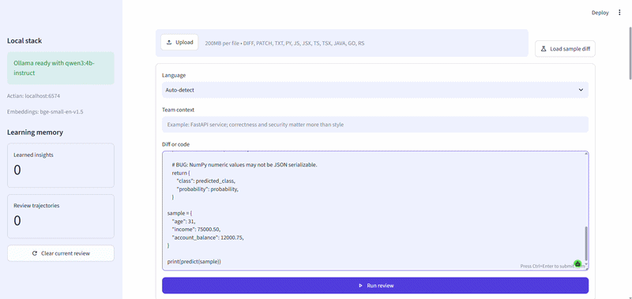
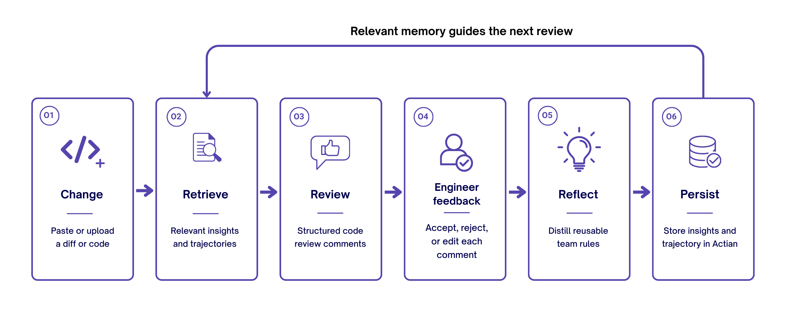

# Self-Evolving Code Review Agent



A code reviewer that learns team conventions from engineer feedback without retraining the model.

## Overview

Most automated code reviewers start from the same generic prompt on every run. This project adds persistent experiential memory. Before reviewing a change, the agent retrieves relevant team rules and similar past review trajectories from [Actian VectorAI DB](https://www.actian.com/databases/vectorai-db/). After generating comments, it pauses until the engineer accepts, rejects, or edits every comment. The feedback is distilled into reusable natural-language insights and stored with the full review trajectory.

The term self-evolving refers to non-parametric adaptation. The Qwen3 model weights and base prompts do not change. What evolves is the external memory supplied to later reviews. Accepted feedback reinforces useful rules, rejected feedback creates lessons about what not to flag, and edited feedback refines the team's preferred wording or convention.

ExpeL extracts natural-language insights from agent experience and retrieves both insights and past trajectories at inference. This project applies that pattern to code review and uses engineer decisions as the outcome signal.

## How It Works



LangGraph runs an explicit retrieve, review, feedback, reflect, and persist workflow. The graph uses an interrupt after comment generation, so the review pauses safely while the Streamlit interface collects one decision per comment. Resuming with the same thread ID sends those decisions into reflection. Only then are new insights and the trajectory written to Actian.

Actian uses two collections. `review_insights` stores distilled rules with polarity, scope, confidence, and source review metadata. `review_trajectories` stores the reviewed change, generated comments, engineer decisions, reflection summary, and rejection metrics. Both collections use BGE embeddings for semantic recall.

## Tech Stack

| Component | Choice | Purpose |
|---|---|---|
| Agent workflow | LangGraph | Explicit retrieve, review, human feedback, reflect, and persist graph |
| Human feedback | LangGraph interrupt and Streamlit controls | Pauses the graph and captures accept, reject, or edit decisions |
| Memory database | Actian VectorAI DB | Persists learned insights and similar review trajectories |
| Embeddings | `BAAI/bge-small-en-v1.5` via sentence-transformers | Embeds diffs, rules, and trajectories locally |
| Language model | `qwen3:4b-instruct` via Ollama | Generates structured review comments and distilled insights locally |
| Interface | Streamlit | Accepts code or diffs, collects feedback, and displays learning trends |

## Prerequisites

| Component | Requirement |
|---|---|
| Python | 3.10 through 3.13 |
| RAM | 16 GB recommended for VectorAI DB, embeddings, and the local LLM together |
| Disk space | At least 10 GB free, with additional space for Docker and model caches |
| Docker | Docker Desktop or Docker Engine running locally |
| Ollama | Installed and running locally |
| uv | Installed as the Python environment and package manager |
| Internet | Required on first setup to download dependencies, Docker images, and models |

VectorAI DB's official Docker guide lists 8 GB RAM and 10 GB disk space as minimums, with 16 GB or more RAM recommended. This project recommends 16 GB because VectorAI DB, sentence-transformers, Ollama, and Streamlit run on the same machine.

## Setup Steps

### 1. Install uv

On Windows PowerShell:

```powershell
winget install --id=astral-sh.uv -e
```

On macOS or Linux:

```bash
curl -LsSf https://astral.sh/uv/install.sh | sh
```

Restart the terminal after installation and run `uv --version` to confirm it is available.

### 2. Clone the repository

```bash
git clone https://github.com/Sumanth077/Hands-On-AI-Engineering.git
cd Hands-On-AI-Engineering/ai_agents/self_evolving_code_review_agent
```

### 3. Create the environment file

```bash
cp .env.example .env
```

The default values connect to local services and require no API key. `ACTIAN_VECTORAI_ACCESS_TOKEN` is only needed if authentication was enabled in your VectorAI DB deployment.

### 4. Start Actian VectorAI DB

```bash
docker compose up -d
```

The Docker Compose file accepts the VectorAI DB EULA and exposes the REST API on port 6573, gRPC on port 6574, and the local database UI on port 6575.

### 5. Pull the local language model

```bash
ollama pull qwen3:4b-instruct
```

The exact Ollama tag is `qwen3:4b-instruct`. Ollama lists it as a 4.02 billion parameter Q4_K_M model with a download size of approximately 2.5 GB and a 256K context window.

## Installation

Create and activate the virtual environment, then install the project in editable mode with uv.

```bash
uv venv
```

On Windows PowerShell:

```powershell
.venv\Scripts\Activate.ps1
uv pip install -e .
```

On macOS or Linux:

```bash
source .venv/bin/activate
uv pip install -e .
```

## Running

Start the Streamlit application from the project directory.

```bash
uv run streamlit run main.py
```

Open `http://localhost:8501`. The sidebar should report that Ollama is ready and both memory counters should initially be zero.

To verify VectorAI DB independently, open `http://localhost:6575` or run `docker ps` and confirm that `self-evolving-review-vectorai` is running.

## Project Structure

```text
self_evolving_code_review_agent/
├── main.py                              # Streamlit review, feedback, and learning UI
├── demo.html                            # Standalone interactive browser demo
├── pyproject.toml                       # uv project metadata and dependencies
├── docker-compose.yml                   # Local Actian VectorAI DB service
├── .env.example                         # Local service configuration template
├── .gitignore                           # Secrets, environments, caches, and DB volume
├── .streamlit/
│   └── config.toml                      # Native Streamlit theme and watcher settings
├── self_evolving_agent/
│   ├── config.py                        # Environment-backed settings
│   ├── embedder.py                      # Local BGE query and memory embeddings
│   ├── graph.py                         # LangGraph workflow and human interrupt
│   ├── llm.py                           # Ollama structured-output client
│   ├── memory.py                        # Actian collections, retrieval, and persistence
│   ├── models.py                        # Typed review and feedback records
│   └── prompts.py                       # Review and reflection contracts
└── assets/
    ├── how_it_works.png                 # Horizontal workflow diagram
    └── demo.gif                         # Added after recording the live app
```

## Customising

Change `OLLAMA_MODEL` in `.env` to use another locally installed Ollama model. The replacement must reliably follow JSON schemas because both review comments and learned insights use structured output. Qwen3 is also tool-capable, although this app keeps memory access deterministic in explicit LangGraph nodes instead of allowing the model to choose whether retrieval happens.

Change `INSIGHT_TOP_K` and `TRAJECTORY_TOP_K` to control how much memory is injected into each review. Change `MIN_RELEVANCE_SCORE` only after inspecting scores on your own review history. BGE's model card notes that absolute similarity thresholds are data-dependent, so retrieval quality should be evaluated on the team's actual diffs rather than assumed from a universal cutoff.

Edit `REVIEW_SYSTEM` and `REFLECTION_SYSTEM` in `self_evolving_agent/prompts.py` to tune review priorities or insight wording. Keep the feedback semantics stable: accept reinforces, reject suppresses, and edit refines. Changing those meanings would make previously stored trajectories inconsistent with new ones.

## Demo

For the standalone mock demo, open `demo.html` directly in a browser. Choose Accept, Reject, or Edit on both comments, then select **Save feedback and teach agent**. The counters and confirmation message update locally without a server. The standalone page is a UI simulation and does not call Ollama or Actian.

For the real demo, start the Streamlit app, select **Load sample diff**, and run the review. Decide on every generated comment and submit the feedback. Open the Insights tab to see the distilled rules, then review a related change and observe that the agent retrieves those rules before generating comments. The Progress tab charts rejected comments per completed review.

The rejection-rate chart measures alignment with engineer decisions. A downward trend means comments need less correction, but it does not by itself prove that reviews are correct or secure.

## Resources

| Resource | Link |
|---|---|
| ExpeL paper | [ExpeL: LLM Agents Are Experiential Learners](https://arxiv.org/abs/2308.10144) |
| LangGraph human feedback | [Interrupts documentation](https://docs.langchain.com/oss/python/langgraph/interrupts) |
| Actian local installation | [VectorAI DB Docker guide](https://docs.vectoraidb.actian.com/home/installation/instructions) |
| Actian SDK example | [VectorAI DB Python quickstart](https://docs.vectoraidb.actian.com/home/quickstart/quickstart) |
| Ollama model | [Qwen3 4B Instruct](https://ollama.com/library/qwen3%3A4b-instruct) |
| Ollama structured output | [Structured Outputs documentation](https://docs.ollama.com/capabilities/structured-outputs) |
| Ollama tool calling | [Tool Calling documentation](https://docs.ollama.com/capabilities/tool-calling) |
| Embedding model | [BAAI/bge-small-en-v1.5 model card](https://huggingface.co/BAAI/bge-small-en-v1.5) |
| uv installation | [Official uv installation guide](https://docs.astral.sh/uv/getting-started/installation/) |
