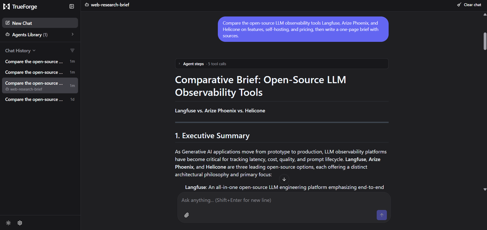

# Build a Long-Running Agent with TrueForge



A runnable web research agent built on [TrueForge](https://github.com/truefoundry/trueforge), the open-source agent harness. You ask a question, the harness plans the turn, searches the web through an MCP tool, fans out to parallel subagents, and builds an interactive one-page brief with sources in a sandbox, streaming every step back.

## Overview

The point of this build is to see the harness do its job. The model is the easy part. TrueForge is the runtime layer around it that runs the full execution loop, routes tools, manages context on long runs, gates sensitive actions, and persists the session so a run survives a reconnect. You configure four resources once (a model, an MCP web-search server, a skill, and a sandbox), save them together as an agent, and run it.

The example agent is a web research briefer. You give it a question or a set of things to compare, and it searches the web, researches each part in parallel, and produces a single interactive page that answers the question with its sources cited. It only reads from the web and never writes back to any external system, so it runs end to end with no write credentials and no risky action, which makes it a safe first agent to build and run. Throughout this guide the agent is saved under the name `web-research-brief`, the name you give it when you save it.

The harness itself is general: the same four building blocks can run almost any kind of agent (a codebase onboarding guide, a dependency or security auditor, an incident triage assistant, a support-ticket drafter, and so on). What changes per use case is which MCP servers and skills you attach and whether the agent takes any write actions; the execution loop, streaming trace, context management, and approval gating you see here work the same way for all of them.

## How It Works

1. You send a research question to the saved agent in the chat.
2. The harness plans the turn, calls the model, and streams every step back.
3. It calls the Exa MCP web-search tool to gather sources (loaded on demand, not preloaded).
4. It fans out to parallel subagents, one per subtopic, each with its own isolated context.
5. It provisions a sandbox and loads a skill to render an interactive one-page brief. A skill is a reusable instruction pack the agent pulls in only when a task needs it, so it is not clutter in the agent's context the rest of the time. Here the skill is `web-artifacts-builder`, which knows how to turn findings into a self-contained web page, and it runs in the sandbox.
6. Context stays lean: large tool results offload to sandbox files and old history compacts past a token threshold.
7. The turn finishes with the final brief plus per-turn token and cost metrics, and every step is a replayable event you can reconnect to.

## Tech Stack

| Layer | Choice |
|---|---|
| Agent harness | TrueForge (`npx @truefoundry/trueforge`, local mode, SQLite) |
| Model | Any configured provider (OpenAI, Anthropic, or Google) |
| Web search | Exa MCP server (no auth) |
| Skill | `web-artifacts-builder` (built-in) |
| Sandbox | Built-in local sandbox (macOS/Linux/WSL); Daytona optional for remote |
| Runtime | Node.js 22+ (for the local server) |
| Driver / SDK (optional) | TypeScript, `@truefoundry/trueforge-sdk` (see [Going further](#going-further-drive-it-from-code)) |

## Prerequisites

Read this section carefully. Missing any of these is the usual reason a run fails.

**1. Node.js 22 or newer.** TrueForge's local server runs on it.

```bash
node --version   # must print v22.x or higher
```

If it is older, install Node 22+ (nvm: `nvm install 22 && nvm use 22`).

**2. A model provider API key.** One of OpenAI, Anthropic, or Google. You paste this into TrueForge Settings, not into this repo. Have the key ready and know which model you want (for example `anthropic/claude-sonnet-4-6` or an OpenAI model you have access to).

**3. A sandbox for the skill.** The brief is rendered by a skill, and skills only run in a sandbox. How you get one depends on your OS:

- **macOS or Linux (including WSL): nothing to do.** TrueForge ships a built-in local sandbox that runs on macOS and Linux, so the skill works with no provider setup.
- **A remote sandbox (Daytona), only if you want one or can't use the local one.** Create an account at https://www.daytona.io, make an API key with permission to write and delete snapshots and write sandboxes, and paste it into Settings → Sandbox providers. This is optional on macOS/Linux and is the fallback for native Windows.

**4. Exa web search.** Nothing to get. Exa is in TrueForge's connector catalog and needs no auth. You just click Connect.

**Notes and gotchas**

- Local mode has no login and stores data in a local SQLite file. Keep it on `localhost`; it is not hardened for internet exposure.
- The default local server URL is `http://localhost:8790`.
- **Native Windows is not supported by the local server today** (it fails to start with an ESM `Received protocol 'c:'` error, and the local sandbox is macOS/Linux only). Run everything inside **WSL2** instead: install/enter Ubuntu, install Node 22+ there, then run `npx @truefoundry/trueforge` from the WSL shell. Your Windows browser still reaches `http://localhost:8790`. Inside WSL the built-in local sandbox works, so no Daytona is needed.

## Setup

### Step 1: Start TrueForge

In a separate terminal, start the local server and leave it running:

```bash
npx @truefoundry/trueforge
```

Open http://localhost:8790. In local mode, Settings are open (no login).

> **Make sure you're in TrueForge, not the TrueFoundry platform.** TrueForge's Settings shows exactly four pages: **Models**, **Connectors**, **Skills**, and **Sandbox providers**. If you instead see things like AI Gateway, SSO, Provisioning, or "Revoke all PAT", you're in TrueFoundry's hosted console, a different product. Go back to `http://localhost:8790` from the `npx` server above.

### Step 2: Configure the four building blocks

In the TrueForge UI, set these up once under **Settings**, in this order.

1. **Models.** Settings → Models → pick your provider → Configure → paste your API key → Create.
2. **Connectors (web search).** Settings → Connectors (this is where you add MCP servers) → find **Exa** → Connect. It needs no auth and moves to Configured.
3. **Skills.** Settings → Skills → enable **web-artifacts-builder** from the built-in list.
4. **Sandbox.** On macOS/Linux (including WSL) there is nothing to configure here: the built-in local sandbox is used automatically once you enable the sandbox on the agent. Only configure a **Daytona** provider if you specifically want a remote sandbox.

### Step 3: Compose and save the agent

In the chat composer, assemble the agent and save it so you can reuse it:

1. Pick your model in the composer.
2. Open the Tools menu, enable the **Exa** connector and the **web-artifacts-builder** skill, and leave **Dynamic sub-agents** on.
3. Send a test message, for example: `Compare the open-source LLM observability tools Langfuse, Arize Phoenix, and Helicone on features, self-hosting, and pricing, then write a one-page brief with sources.`
4. Click **Save Agent**, name it `web-research-brief`, add the instructions below, and save. It now appears in your **Agents Library**, where you can Try or Edit it.

Suggested instructions:

```text
You are a web research assistant. Given a topic or question, use Exa to search the web and pull content from the most relevant, recent sources. When the request compares several items, research each one in parallel, then synthesize the findings into a clear one-page brief with sources.
```

## Run it

Open the saved agent from the **Agents Library** (or just keep chatting in the same session), send a research question, and watch the harness work. Try:

```text
Compare the open-source LLM observability tools Langfuse, Arize Phoenix, and Helicone on features, self-hosting, and pricing, then write a one-page brief with sources.
```

You can ask anything; the comparison shape is what makes it fan out to parallel subagents.

## What you'll see

You can watch each part of the run in the chat:

- The agent calls out to **Exa** to search the web.
- It spawns a **subagent per item** being compared, shown under **Agent steps**, each researching in parallel.
- The answer **streams in** as it is written.
- A **sandbox** comes up and the **web-artifacts-builder** skill renders the final interactive one-page brief with its sources.
- The run reports its **token and cost totals**.


## Going further: drive it from code

Everything above happens in the UI, which is all you need. If you want to run the same saved agent programmatically, this repo includes a small TypeScript driver (`driver.ts`) that opens a session, streams one turn, and prints the whole trace.

This part needs `npm` available, and on Windows it must run from the WSL shell (see the Windows note in Prerequisites).

### Install

In this folder:

```bash
npm install
cp .env.example .env
```

Then open `.env` and set `TRUEFORGE_BASE_URL` (leave the default `http://localhost:8790` for local mode). No token is needed locally.

### Run

With the TrueForge server running and the agent saved:

```bash
npm start -- "Compare the open-source LLM observability tools Langfuse, Arize Phoenix, and Helicone on features, self-hosting, and pricing, then write a one-page brief with sources."
```

You can pass any question as the argument. With no argument it uses a default question. Research turns run long; the driver sets the SDK timeout to 600 seconds, so do not lower it.

### The printed trace

The driver prints a labeled trace of the whole run:

- `turn.created` — the run starts.
- `mcp.initialize` — the harness connected to Exa.
- `sandbox.created` — a sandbox was provisioned (once per session).
- `subagent: ...` — each parallel subagent that spawned (from `thread.created`).
- The root agent's reply streaming in, token by token.
- `tool.response` — a tool returned a result.
- `turn.done` — the final brief, plus per-turn token and cost metrics.

### Reconnect to a running session

Every step is a persisted event, so a dropped stream is recoverable. Persist `session.id`, `turnId`, and the last sequence number; on reconnect call `getTurn`, then `subscribeToTurn({ afterSequenceNumber })` if it is still running, or `listTurnEvents` if it already finished. The pattern is in `driver.ts`.

### Project structure

```
trueforge_web_research_briefer/
├── driver.ts          # opens a session, streams the turn, prints the trace
├── package.json       # SDK + tsx
├── .env.example       # TRUEFORGE_BASE_URL (+ optional token for hosted mode)
├── .gitignore
└── README.md
```

### Customising

- Swap the web-search MCP server for another catalog connector.
- Swap `web-artifacts-builder` for a different skill (for example a PDF skill) to change the deliverable.
- Attach a write connector and gate it to make the approval pause live.
- Point the driver at a saved agent by name, or pass an inline spec (see `driver.ts`).

## Resources

- TrueForge source (open source): https://github.com/truefoundry/trueforge
- TrueForge introduction: https://trueforge.dev/introduction
- Quickstart (build the agent in the UI): https://trueforge.dev/quickstart
- Create an agent (every option): https://trueforge.dev/create-agent/overview
- SDK quickstart: https://trueforge.dev/api/quickstart
- Use an agent (streaming, approvals, reconnects): https://trueforge.dev/api/use-agent
- Harness capabilities (context engineering): https://trueforge.dev/key-features/overview
